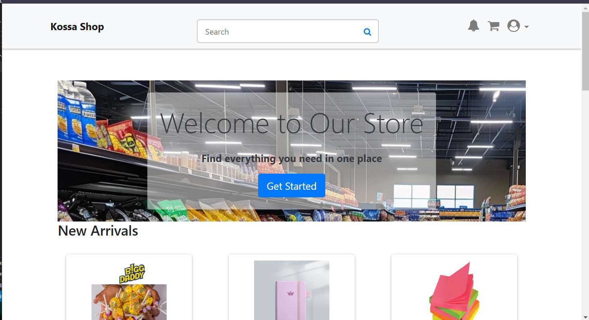
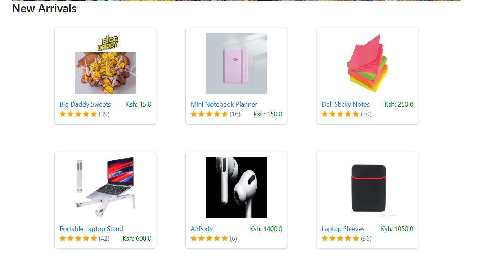
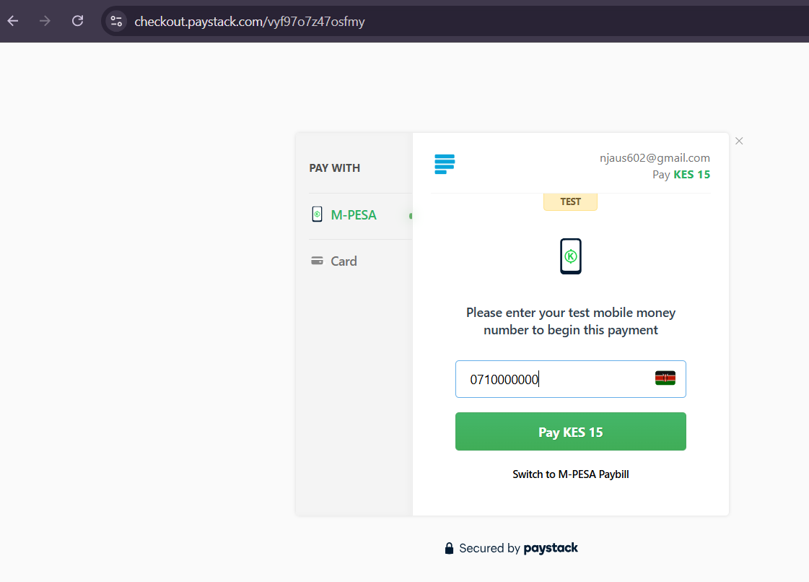
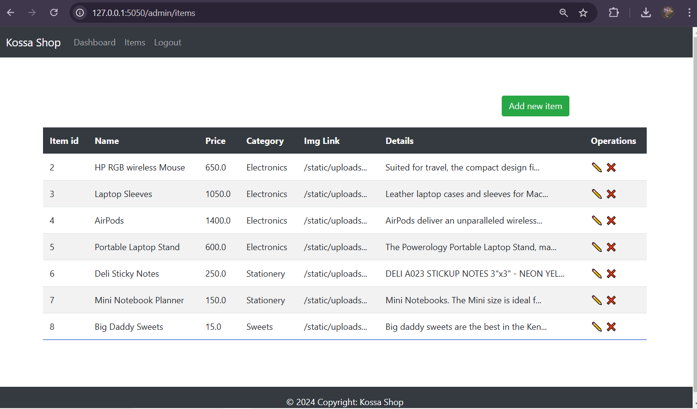

# Kossa Shop

Kossa Shop is a Python-based e-commerce application built using Flask. It provides a seamless shopping experience with robust order processing, user authentication, and payment integration.

---

## Features
- **Cart, Orders, and Items Management**: Includes a complete order processing system.
- **User Authentication**: Proper user authentication and authorization for secure access.
- **Payment Integration**: Integrated with Paystack for seamless payment processing.
- **Custom Admin Panel**: Manage orders and items effectively through a custom-built admin interface.
- **Item Search**: Find products easily with a search feature.
- **Responsive UI**: Built with Bootstrap and custom CSS for an elegant user interface.

---

## Screenshot

****
****
****
****

Add a screenshot of the application’s UI here to give users a quick visual overview of Kossa Shop.

---

## Prerequisites

Ensure the following prerequisites are met before setting up Kossa Shop:
- [Python](https://www.python.org/) installed on your machine.
- Paystack API key for payment integration. Learn more at [Paystack Setup](https://paystack.com/docs/payments/accept-payments/).

---

## Installation

Follow these steps to run Kossa Shop locally:

### Step 1: Clone the Repository
```bash
git clone https://github.com/NjauSamuel/flask-shop.git
cd flask-shop
```

### Step 2: Install Dependencies
```bash
pip install -r requirements.txt
```

### Step 3: Set Up a Virtual Environment (Optional)
For better dependency management, activate a virtual environment:
```bash
env_name\Scripts\activate
```

### Step 4: Configure Paystack API Key
Set your Paystack API key in the appropriate configuration file or environment variable.

### Step 5: Run the Application
```bash
python app.py
```
Access the application at `http://localhost:5000`.

---

## Live Project
Check out the live version of Kossa Shop at: [https://kosashop.eucossa.com](https://kosashop.eucossa.com)

---

## Author
This project is owned and maintained by [Samuel Njau](https://www.linkedin.com/in/samuel-njau/).

---

## License
This project is licensed under the MIT License. See the LICENSE file for details.

